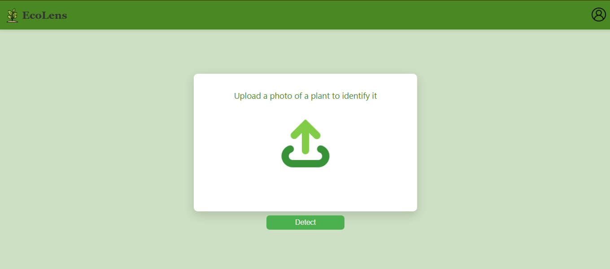
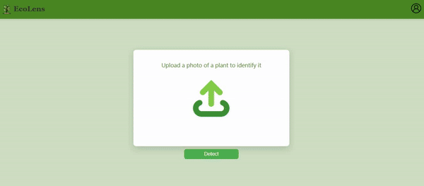
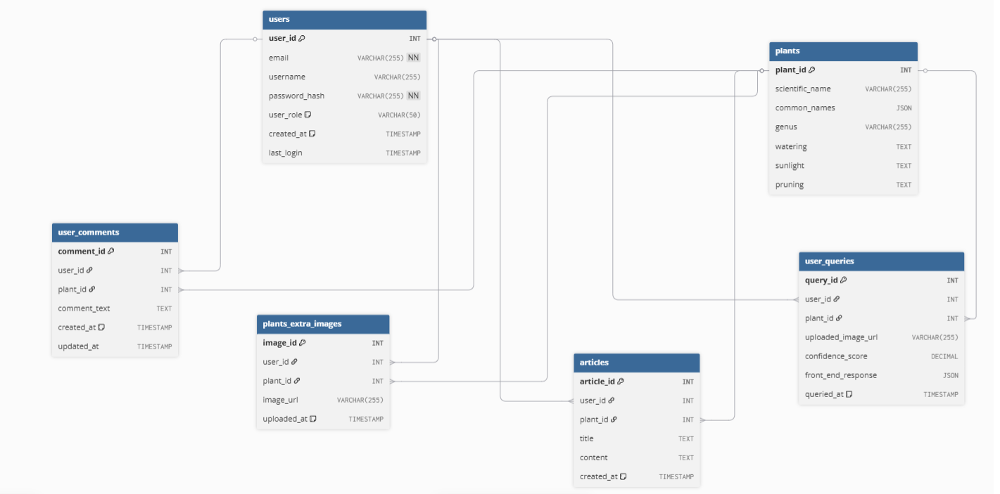

# Plant Detector App

## Contents
- 🌸 [Introduction](#introduction)
    - 🌸 [Key Features](#-key-features)
- 🌸 [Quick Start](#quick-start)
- 🌸 [Project Structure](#project-structure)
- 🌸 [Features - User Guide](#features---user-guide)
    - 🌸 [Main interface](#-main-interface)
    - 🌸 [Uploading a plant's image](#-uploading-a-plants-image)
- 🌸 [Database Schema](#database-schema)
- 🌸 [Deployment & Live Demo](#deployment--live-demo)
- 🌸 [Free use limitations](#free-use-limitationss)
- 🌸 [Next Steps](#next-steps)
- 🌸 [Contact](#contact)

## Introduction
The Plant Detector is a full-stack web application designed to accurately identify plants from user-uploaded images. This project showcases a modern, responsive web interface built with **React** on the frontend and a robust **API-driven** backend powered by **PHP**. 

### 🌸 Key Features
* **Image-Based Plant Identification**: Users can upload a photo of a plant to receive a detailed identification, including its common and scientific names, along with crucial care information (watering, sunlight, pruning).

* **Intelligent Caching with Relational Database**: A custom relational database stores previously identified plant data and user queries, significantly reducing redundant API calls and speeding up subsequent identifications. (*under-development*)

* **API Integration**: The application seamlessly integrates with external APIs such as PlantNet for advanced plant recognition and Perenual for gardening plant data.

* **User Authentication & History**: Future enhancements will include user login/signup functionality, enabling personalized features like storing a user's plant identification history. (*under-development*)

* **Community Engagement**: Dedicated features for User Comments and Related Articles will allow users to share insights, discuss plants, and contribute knowledge to the community. (*under-development*)

* **Rich Visual Content**: The "More Images" feature will empower users to upload and view additional images for specific plants, creating a more comprehensive visual database. (*under-development*)

## Quick Start
To use the application visit [plant-detector](https://plant-detector-project.netlify.app/)

## Project Structure
The project is split into two diffeent repositories.
🌸[plant-detector-frontend](https://github.com/aristeap/plant-detector-frontend)
* is the front-end repository

🌸[plant-detector-backend](https://github.com/aristeap/plant-detector-backend)
* is the back-end repository

## Features - User Guide

### 🌸 Main Interface

### 🌸 Uploading a plant's image
* The user can click the upload icon of the main interface in order to upload a plant, or flowers image, for the application to identify it.

## Database Schema
I have integrated a relational mysql database. It contains the tables: user,user_comments, user_queries, plants, plants_extra_images, articles

🌸 **ER** diagram:

## Deployment & Live Demo
Secure & Scalable Architecture: The frontend is hosted on Netlify, while the PHP backend is deployed as a containerized service on Render, ensuring a reliable and scalable architecture.

Efficient Deployment Pipeline: The project utilizes a CI/CD pipeline with GitHub for version control, allowing for automated builds and deployments on both platforms.

## Free use limitations

## Next Steps

## Contact
I would love to hear any feedback, ideas for additional functionality or any questions you might have 😊! Contact me anytime at : 
* [aristeapapaspyroy@gmail.com](mailto:aristeapapaspyroy@gmail.com)
* [Linkedin](https://www.linkedin.com/in/aristea-papaspyrou-8277a02a0/)
